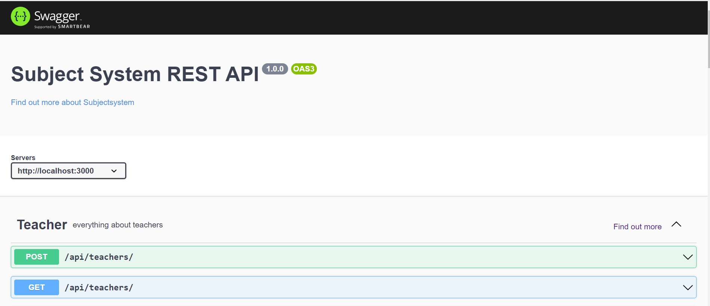
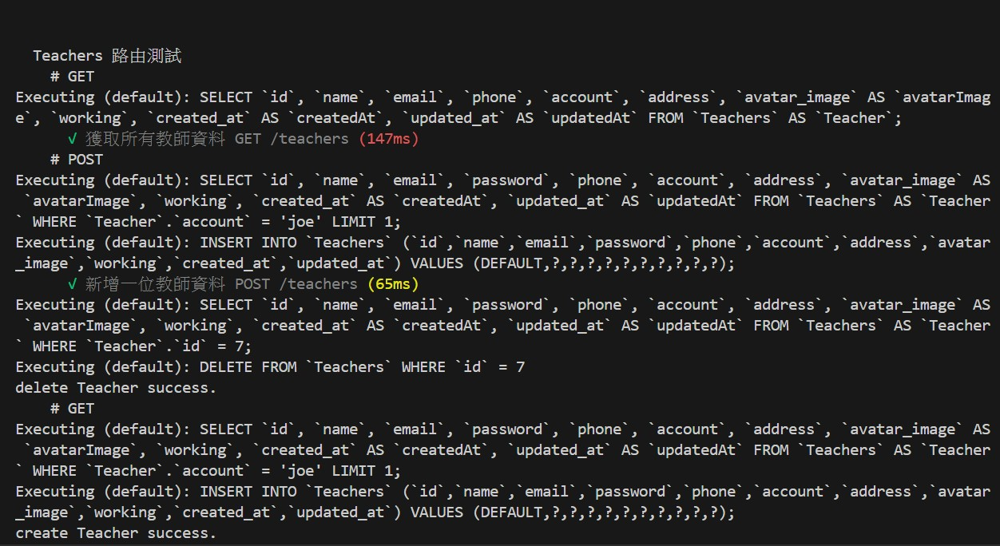

# SubjectSystem 學生選課系統 API 伺服器
SubjectSystem 是一個使用 Node.js 搭配 Express 框架 MySQL 資料庫建立的專案，以 RESTFul API 實作學生選課的 API server。
## 專案緣起
因對 GO 語言的興趣，從而在官網上學習了基本語法並使用 GIN 框架。透過官方範例，我深入了解了 Swagger 工具，並在實際操作中發現，它能自動生成 API 文檔，改變開發前撰寫 API 文件的方式。藉由實作後端 API 伺服器，我運用 Swagger 套件生成直觀易用的 API 文檔。此外，我還進行了單元測試，這不僅增強了我對測試流程的熟悉度，還提升了整體代碼的可靠性和穩定性。透過這些步驟，我更加深入理解了 API 開發的最佳實踐，並學會了如何有效地測試和維護代碼。 

### Swagger-ui

## 功能介紹

- 藉由 Swagger-ui 介面對學生選課系統各個 API 路由 CRUD 操作。
- 也可生成 API 文檔，導入 Postman，對各個 API 路由進行操作。

## 啓動方式
- 將專案 clone 到本地端
  https://github.com/chenstephen0501/subjectsystem.git

- 進入到專案資料夾 
  cd subjectsystem
- 安裝 npm 
  npm install
- 啓動專案 
  npm run dev
- 終端機出現以下字幕，表示終端機成功開啓。 
  subjectsystem running on http://localhost:3000/api-doc
- 建立 subjectsystem 資料庫
- 建立 table  
  npx sequelize db:migrate  
- 建立種子資料  
  npx sequelize db:seed:all  

## 單元測試
- npm run test  
  
  最後會看到 4 passing 測試的路由成功。
 
## 開發環境
- node 14.15.0
- express 4.17.3
## 輔助套件
- chai 4.3.6
- cors 2.8.5
- dotenv 16.0.3
- mocha 8.4.0
- mysql2 2.2.5
- nodemon 2.0.22
- sequelize 6.3.5
- sequelize-cli 6.2.0
- supertest 6.3.3
- swagger-autogen 2.23.1
- swagger-ui-express 4.6.2

